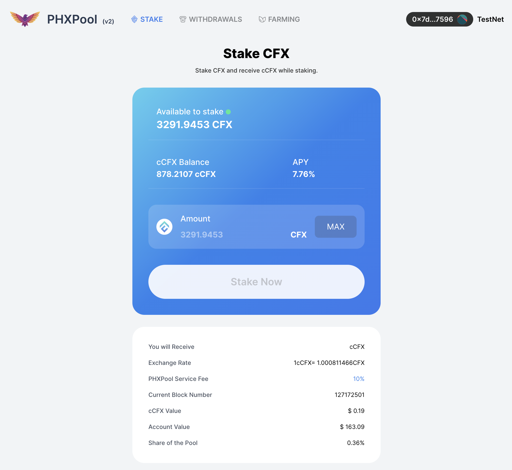

After over two months of development, PHX V2 is finally nearing completion. This is a significant milestone for the PHX metaverse.

PHX V2 is a major upgrade that has the following advantages compared to V1:

1. Improved liquidity of funds, along with increased interaction with other DEFI protocols.
2. Significantly reduced lock-up time.
3. Supports compounding, resulting in higher yields.
4. Completely new UI, which is more streamlined and user-friendly.

Starting today, PHX V2 will undergo a one-week public test, and anyone can participate in using V2. We welcome everyone to raise questions and provide feedback, and the first 100 users will receive a reward of 100 PHX.

* PHX V2 link: https://app.phxverse.com
* Conflux eSpace faucet: https://efaucet.confluxnetwork.org/
* Receiving condition: The user must have interacted with PHX V2 cCFX contract, PHX staking contract, LP staking contract.
* Where to post issues: https://github.com/phx-verse/docs/issues

We will also start the first round IDO at 2023.6.25. Please pay attention to PHXVerse twitter for more information.
