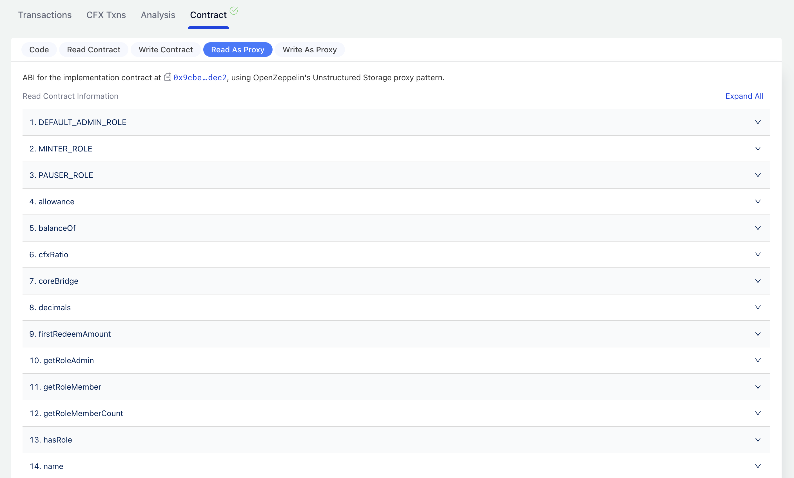

# cCFX Contract

The cCFX contract is the core of PHX v2, which allows users to stake CFX and earn rewards through PoS. It also functions as a standard ERC-20 contract. Its address is: [`0xa11ad495c3bf53c19368313a894ba49bc26e7f92`](https://evm.confluxscan.io/address/0xa11ad495c3bf53c19368313a894ba49bc26e7f92?tab=contract-viewer)

It extends the following methods on the basis of ERC20 to realize the function of depositing CFX and participating in PoS to obtain income.

1. `deposit`: deposit CFX
2. `redeem`: initiate a redemption request for CFX.
3. `withdraw`: withdraw CFX back(after redemption is completed)
4. `cfxRatio`: exchange rate between CFX and cCFX
5. `userRedeemedAssets`: CFX amount in user redemption
6. `userWithdrawableAssets`: CFX amount that can be withdrawn after redemption is completed

The overall operation process is:: `deposit -> redeem -> withdraw`

## Core Methods

### deposit

```js
function deposit() external;
```

By calling this method and setting the transaction's `value` to deposit CFX, CFX will be converted to cCFX proportionally and distributed to the user. cCFX represents the user's share in the entire PoS pool and is also the certificate for the user to redeem CFX. There are no restrictions on the amount of CFX that can be deposited.

### redeem

```js
function redeem(uint256 shares) external;
```

To redeem CFX, you need to initiate a request using the redeem method. This method requires one parameter called `shares`, which specifies the number of cCFX to be redeemed. The method will destroy the user's cCFX and add their redemption request to the redemption queue.

### userRedeemedAssets

```js
function userRedeemedAssets(address user) external view returns (uint256);
```

This method is used to query the amount of CFX in redemption for users, that is, the amount of CFX that has been requested for redemption but has not yet been redeemed by the user.

After the user initiates a redemption request, if the amount is small, it can be completed within a few minutes and can be withdrawn immediately after completion. In most cases (80%), the redemption time will be completed within 1 day. In extreme cases (when the redemption amount is relatively large), it may take several days.

### userWithdrawableAssets

```js
function userWithdrawableAssets(address user) external view returns (uint256);
```

This method is used to query the amount of CFX that can be withdrawn by the user after completing the redemption.

### withdraw

```js
function withdraw(uint256 amount) external;
```

Call this method to extract the redeemed CFX from the completion and transfer it to the personal account.

## Complete Contract Interface

Complete contract interface can be checked in [Conflux Scan account page's contract tab](https://evm.confluxscan.io/address/0xa11ad495c3bf53c19368313a894ba49bc26e7f92?tab=contract-viewer)



## FAQs

### How to earn PoS rewards?

By holding cCFX you can earn PoS rewards, because the cCFX/CFX exchange ratio is continually increase, at an estimated 12% APY. Which means if you hold 100 cCFX for one year, you can exchange 112 CFX back.

### What the redeem complete period?

Normally the redeem duration is couple minutes to one day.