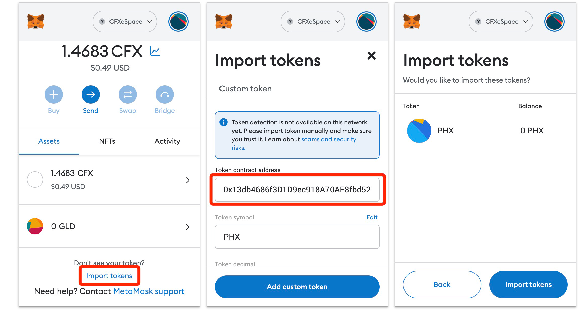

# Claim Airdrop

PHX is the governance token of PHXVerse, deployed on Conflux eSpace, the token address is `0x13db4686f3D1D9ec918A70AE8fbd52f82949906C`.

If you are a user of PHX pool or a holder of the PHX Pool v1 Genesis NFT, then you have the opportunity to claim PHX tokens. The claiming process is as follows:

## eSpace Pledge User

Users who have pledged on Conflux eSpace do not need to claim the PHX tokens manually. The tokens will be airdropped directly to their accounts, and they can view them by adding PHX to their wallets:

## Core Space Pledge User

Users who have staked in the Conflux Core space need to use the airdrop tool on [confluxhub.io](https://confluxhub.io/espace-airdrop) to receive PHX in their MetaMask wallet. This tool requires users to install both Fluent and MetaMask wallets.

If the user has not yet installed the MetaMask wallet, please go to [https://metamask.io/](https://metamask.io/) to install and set up the wallet. Then follow the instructions in [**Using MetaMask on Conflux eSpace**](http://doc.confluxnetwork.org/docs/espace/learn/tutorials/user_metamask_interact_evmspace/) to add the Conflux eSpace network into MetaMask.

After wallets ready, open the [airdrop page of ConfluxHub](https://confluxhub.io/espace-airdrop). When you open it for the first time, the page will prompt you to connect Fluent and MetaMask wallets.

After connecting both wallets, you can see the list of airdrop tokens. If there are tokens available for claiming, the claim button will be clickable. Click on it to claim the tokens.

The one-click option is available on this page to add the token to MetaMask wallet (the button next to the address). After adding, you can view the received PHX tokens in your MetaMask wallet.