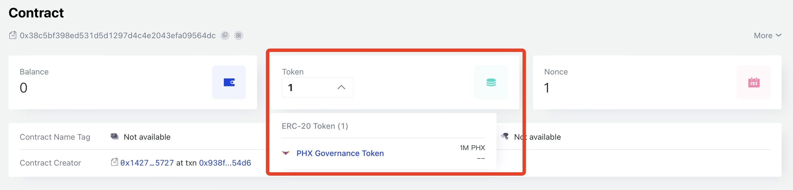

# IDO

:::tip IDO is already finished.
:::

In order to provide sufficient liquidity on Dex (Swappi) during the launch of PHXPool V2, we will raise a certain amount of CFX through IDO before the launch of PHXPool V2 according to the following rules:

* IDO amount: 1000,000 PHX
* IDO price: 1 PHX = 0.1 CFX
* Single purchase limit: 10,000 PHX
* IDO block chain: Conflux eSpace
* IDO start time: 2023-06-25 10:00:00 UTC (block height 73,960,109)

All raised CFX will be used to provide PHX/CFX trading liquidity.

## How to participate in IDO

Participation is very simple, just send CFX directly to the IDO contract address, which is [`0x38c5BF398Ed531d5D1297D4c4E2043efA09564dc`](https://evm.confluxscan.org/address/0x38c5bf398ed531d5d1297d4c4e2043efa09564dc). After the transaction is successful, you will receive the corresponding amount of PHX.

**Attention: Please check if the PHX balance of the IDO contract is 0 before sending. If it is 0, it means that the IDO has been sold out. Also, please make sure the target address is correct.**

## FAQs

### 1. How to view PHX obtained through IDO?

You can add PHX token to your wallet (eg Metamask) to check PHX balance. PHX contract address: `0x13db4686f3d1d9ec918a70ae8fbd52f82949906c`

### 2. Why I didn't receive PHX?

Please make sure your transaction is execute successfully. If it is successful, but you didn't receive PHX, please contact the administrator in the community.

### 3. Why I can't send transaction, why the transaction is failed?

Try to increase the Gas limit if the transaction cannot be sent. If the transaction fails, it may be that the IDO has been sold out or the single purchase limit (1000 CFX) has been exceeded.

### 4. What is the total circulation of PHX and what is its specific purpose?

Check [PHX DAO](/phxdao) for details.